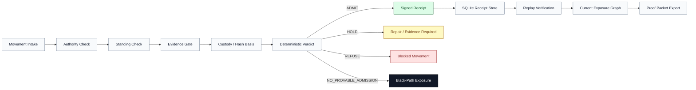
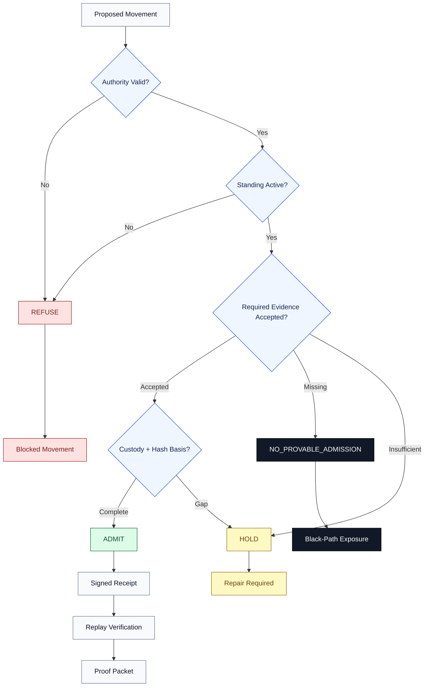

# Elyria Admission Runtime

<p align="center"><strong>Consequence Admission Before Execution Binds</strong></p>

<p align="center">
  ◈ Full-Stack Admission Runtime &nbsp; │ &nbsp;
  ◈ Evidence-Gated Verdicts &nbsp; │ &nbsp;
  ◈ Signed Receipts &nbsp; │ &nbsp;
  ◈ Replay Verification &nbsp; │ &nbsp;
  ◈ Black-Path Exposure
</p>

<p align="center">
  <strong>Samantha Revita / Elyria Systems</strong>
</p>

---

## ◈ Position

Elyria Admission Runtime is a **full-stack consequence-admission runtime** for systems where action should not become operationally real without valid authority, active standing, sufficient evidence, preserved custody, deterministic verdicting, signed receipt, and replayable proof.

It is not a concept note and not only a proof artifact. It is a runnable public product layer with dashboard intake, API assessment, deterministic admission logic, structured evidence gating, signed receipts, local storage, replay verification, exposure graphing, and proof-packet export.

It asks the stricter operational question:

> Can this action become real right now, under valid authority, active standing, sufficient evidence, preserved custody, refusal logic, signed receipt, and replayable proof?

## ◈ Current Claim

```text
Elyria Admission Runtime is a full-stack consequence-admission runtime and bounded public product layer within Elyria's universal consequence-governance architecture.
```

The architecture layer is universal. The public repo claim is bounded.

This repository exposes the reviewable product/runtime layer of Elyria Admission Runtime. It does **not** expose protected Elyria / Veritas internals, claim substrate status, or claim production certification without security and customer-specific review.

## ◈ Quickstart

Run the full local reviewer path:

```bash
git clone https://github.com/Kamanaka5502/elyria-admission-runtime.git
cd elyria-admission-runtime
python -m venv .venv
source .venv/bin/activate
python -m pip install --upgrade pip
python -m pip install -r requirements.txt
python -m pytest tests
uvicorn apps.api.main:app --reload --host 0.0.0.0 --port 8080
```

Open the dashboard:

```text
http://localhost:8080
```

Reviewer flow:

```text
1. Load dashboard
2. Reset sandbox + generate receipts
3. Submit accepted movement
4. Submit black-path movement
5. Load current exposure graph
6. Replay receipt
7. Export proof packet
```

Expected result:

```text
Dashboard loads.
Movement can be submitted.
Evidence can be attached.
Signed receipt is emitted.
Replay verifies.
Current graph updates.
Proof packet exports.
Tests pass locally.
```

## ◈ Container Install

The runtime can also run as an installable dashboard/API container.

Local container build:

```bash
docker build -t elyria-admission-runtime:local .
docker run --rm -p 8080:8080 elyria-admission-runtime:local
```

After the GitHub Container Registry package is published, reviewers can run:

```bash
docker pull ghcr.io/kamanaka5502/elyria-admission-runtime:v0.8.1-public
docker run --rm -p 8080:8080 ghcr.io/kamanaka5502/elyria-admission-runtime:v0.8.1-public
```

Open:

```text
http://localhost:8080
```

Container posture:

```text
source review remains proprietary
container distribution does not grant reuse rights
production use requires a separate written agreement
```

## ◈ Engine Flow

Elyria Admission Runtime evaluates whether movement may bind operational consequence. It does not wait for harm, drift, or audit discovery after the fact; it classifies movement before execution becomes real.



Pipeline summary:

```text
intake → authority → standing → evidence → custody/hash basis → verdict → receipt → storage → replay → graph → proof packet
```

## ◈ Example Exposure Graph

The exposure graph shows where a movement sits after runtime classification. Green paths are admitted. Yellow paths require repair. Red paths are blocked. Black paths indicate movement attempting to bind without durable proof.



Example verdict distribution:

```text
ADMIT                 → evidence accepted, authority valid, standing active
HOLD                  → evidence or custody requires repair
REFUSE                → movement is blocked by invalid authority, inactive standing, or refusal state
NO_PROVABLE_ADMISSION → movement attempts to bind without durable proof
```

## ◈ Runtime Status

| Capability | Status |
|---|---|
| Full-stack dashboard | present |
| API assessment path | present |
| Deterministic admission engine | present |
| Structured evidence gate | enforcement-bearing |
| Signed receipt envelope | present |
| Replay verification | present |
| SQLite receipt storage | present |
| Current exposure graph | present |
| Proof packet export | present |
| Reviewer test path | present |
| Production claim | production-oriented / not certified |

## ◈ Runtime Path

A reviewer can run the stack locally and inspect a complete consequence-control path:

```text
movement intake
→ authority / standing / evidence / custody checks
→ evidence gate logic
→ deterministic verdict
→ signed receipt
→ SQLite receipt storage
→ replay verification
→ current exposure graph
→ proof packet export
```

The runtime classifies movement into four operational verdicts:

| Verdict | Color | Meaning |
|---|---:|---|
| `ADMIT` | green | movement may bind consequence |
| `HOLD` | yellow | proof is incomplete or evidence needs correction |
| `REFUSE` | red | movement is blocked by refusal, invalid authority, or inactive standing |
| `NO_PROVABLE_ADMISSION` | black | movement is attempting to become real without durable proof |

The black path is the executive risk surface. It exposes movement that may otherwise bind without sufficient proof.

## ◈ Full-Stack Guts

| Layer | Files | Purpose |
|---|---|---|
| Interface | `apps/api/static/index.html` | dashboard, token panel, movement intake, evidence editor, receipts, replay, proof export |
| API | `apps/api/main.py` | FastAPI endpoints for assessment, receipts, replay, exposure graph, proof packet, sandbox reset |
| Admission Engine | `src/consequence_twin/engine.py` | deterministic verdict selection: `ADMIT`, `HOLD`, `REFUSE`, `NO_PROVABLE_ADMISSION` |
| Evidence Gate | `src/consequence_twin/evidence.py` | structured evidence summary and enforcement-bearing evidence status |
| Receipts | `src/consequence_twin/receipt_runtime.py` | signed receipt envelope, input hash, evidence summary, replay basis |
| Storage | `src/consequence_twin/storage.py` | local SQLite receipt persistence and retrieval |
| Graph | `src/consequence_twin/graph.py` | consequence exposure graph from demo or stored receipt-backed movements |
| Auth | `src/consequence_twin/auth.py` | client-mode bearer-token protection for protected endpoints |
| Tests | `tests/` | engine, API, auth, storage, evidence, receipt replay, dashboard surface, full-stack path |
| Docs | `docs/`, root review files | buyer readout, claim boundary, reviewer quickstart, proof/demo path, limitations |

## ◈ v0.8 Evidence Gate Logic

Structured evidence is now enforcement-bearing when present.

Evidence is not decorative metadata. It can control the verdict.

Rules:

```text
accepted required evidence → ADMIT remains available
missing required evidence → NO_PROVABLE_ADMISSION when authority and standing could otherwise bind
insufficient required evidence → HOLD
missing custody owner → HOLD
missing hash/reference → HOLD
unsupported evidence status → HOLD
```

This prevents a movement from claiming clean admission while its structured evidence record contradicts that claim.

## ◈ Signed Receipt and Replay Basis

Each assessed movement emits a receipt containing:

```text
receipt_id
movement_id
verdict
color
reasons
timestamp_utc
input_hash
engine_version
original_input
evidence_summary
signature_algorithm
signature
```

Replay verifies:

```text
input_hash_matches
verdict_matches
signature_matches
evidence_summary_matches
```

## ◈ Client Mode

Client mode protects receipt, replay, proof export, sandbox reset, current graph, and movement-assessment endpoints behind a bearer token.

```bash
export ELYRIA_MODE=client
export ELYRIA_API_TOKEN="replace-with-local-demo-token"
export ELYRIA_RECEIPT_SIGNING_SECRET="replace-with-local-signing-secret"
uvicorn apps.api.main:app --reload --host 0.0.0.0 --port 8080
```

Browser flow:

```text
Save Token Locally
Test Protected Access
Reset Sandbox + Generate Receipts
Preset Accepted Evidence
Submit Movement + Emit Receipt
Preset Black Path
Submit Movement + Emit Receipt
Load Current Stored Graph
Load Receipt Cards
Replay Receipt
Export Proof Packet
```

## ◈ API Surface

| Method | Endpoint | Purpose | Client Mode |
|---|---|---|---|
| `GET` | `/healthz` | service status | public |
| `POST` | `/movements/assess` | submit movement, emit signed receipt | protected |
| `GET` | `/receipts` | list stored receipts | protected |
| `GET` | `/receipts/{receipt_id}` | read one receipt | protected |
| `POST` | `/receipts/{receipt_id}/replay` | replay and verify receipt | protected |
| `GET` | `/exposures/demo` | load demo exposure graph | public |
| `GET` | `/exposures/current` | build graph from stored receipts | protected |
| `GET` | `/demo/proof` | export proof packet | protected |
| `POST` | `/sandbox/reset` | reset demo receipt store | protected |

## ◈ Buyer / Reviewer File Set

| File | Purpose |
|---|---|
| `CLAIM_BOUNDARY.md` | exact public claim and non-claim boundary |
| `FULL_STACK_SCOPE.md` | full-stack layer map and reviewer standard |
| `REVIEWER_QUICKSTART.md` | one clean reviewer command path |
| `BUYER_READOUT.md` | buyer-facing explanation and inspection list |
| `PROOF_OR_DEMO_PATH.md` | click-by-click proof path |
| `LIMITATIONS.md` | production, evidence, auth, signing, and data boundaries |
| `docs/10_executive_demo_script.md` | executive demo talk track |
| `docs/11_buyer_one_page.md` | one-page buyer framing |
| `docs/12_demo_screenshot_and_proof_safety.md` | screenshot/proof-packet safety checklist |
| `docs/13_public_product_page_copy.md` | product-page copy |
| `docs/14_screenshot_capture_plan.md` | screenshot sequence and captions |
| `docs/15_evidence_enforcement.md` | v0.8 evidence gate summary |

## ◈ Production Posture

This repo is **demo-ready and production-oriented**, not production-certified.

Production deployment requires security review, secret management, enterprise authentication and authorization, customer-specific policy mapping, customer-specific evidence mapping, logging and retention review, deployment hardening, key-management review, legal/compliance review where applicable, and operational acceptance testing.

Correct production boundary:

```text
Full-stack admission runtime, not production certification.
Universal architecture layer, bounded public repo claim.
Samantha Revita / Elyria Systems.
```

## ◈ Engagement Boundary

Qualified implementation, review, and pilot engagements are scoped privately.

Scope depends on the governed movement, evidence complexity, deployment boundary, authority model, customer review requirements, and required operational depth.

No public package terms are defined in this repository.

## ◈ Safety Boundary

Use sanitized demo data only for public demos, proof packets, and reviewer runs.

Do not use live credentials, customer identifiers, regulated records, private evidence, or production proof packets in public examples.

## ◈ Ownership

```text
Samantha Revita / Elyria Systems
```

All rights reserved.
