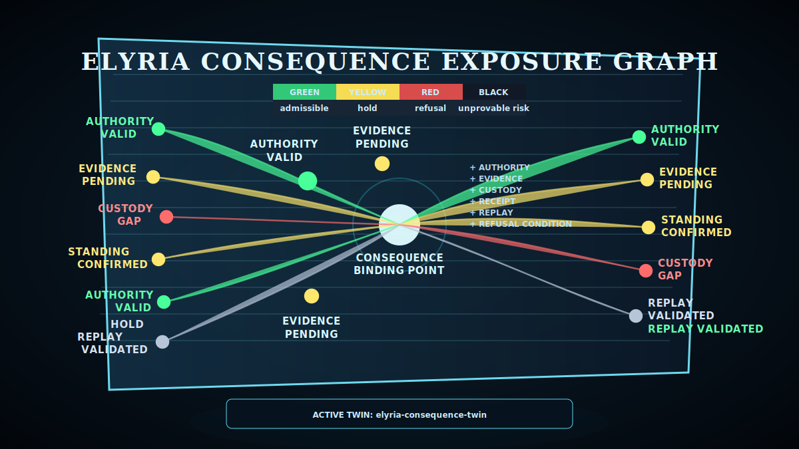
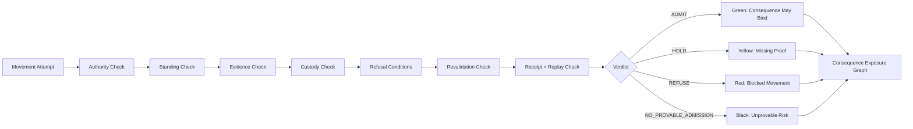

<p align="center">
  
</p>

# Elyria Consequence Twin

**A digital twin for consequence-bearing execution.**

Elyria Consequence Twin maps where organizational action can become real, where it must be refused, and what proof must exist before consequence binds.

Most governance, risk, workflow, and AI oversight tools document what exists, what happened, who approved something, or where controls are mapped.

Elyria answers a stricter operational question:

> Can this action legally, operationally, evidentially, and structurally become real right now?

## Why This Matters

Modern organizations execute thousands of AI, workflow, access, approval, payment, deployment, and customer-operation actions daily.

Most systems track what happened after execution. They do not prove whether the action had standing to become operationally real before consequence bound.

Elyria Consequence Twin exposes where consequence is binding without valid authority, sufficient evidence, preserved custody, active standing, refusal logic, receipt, or replay.

That is the surface where operational failures, governance collapse, AI mis-execution, and unprovable decisions become expensive.

## Core Position

**Know where action becomes consequence before it binds.**

The system models consequence-bearing movement across AI recommendations, operator approvals, payment releases, customer escalations, data access, workflow overrides, model updates, vendor handoffs, policy exceptions, and system deployments.

Each movement is evaluated against:

- authority
- standing
- evidence
- custody
- admissibility
- refusal conditions
- revalidation triggers
- receipt requirements
- replay proof

## How the Engine Works

A consequence-bearing movement is evaluated through a deterministic admission pipeline. No movement silently binds. Every missing or invalid dimension becomes **HOLD**, **REFUSE**, or **NO_PROVABLE_ADMISSION**.



### Assessment Pipeline

1. Identify the attempted consequence-bearing movement.
2. Confirm authority exists and is valid for the movement scope.
3. Confirm standing is active at bind time.
4. Confirm required evidence exists before effect.
5. Confirm custody holds across systems, teams, and handoffs.
6. Apply refusal and hold conditions.
7. Check whether material changes require revalidation.
8. Confirm receipt and replay proof exist.
9. Emit verdict and graph color.

## Concrete Exposure Graph Example

```text
AI Recommendation ── MOVE-001 / ADMIT / green ──> Operator Approval
AI Recommendation ── MOVE-002 / NO_PROVABLE_ADMISSION / black ──> Customer Escalation
Unscoped Override ── MOVE-003 / REFUSE / red ──> Payment Release
```

Example files:

- `examples/sample_graph.json`
- `examples/sample_assessments.json`
- `examples/sample_results.json`

The sample assessment output includes:

```json
{
  "movement_id": "MOVE-002",
  "verdict": "NO_PROVABLE_ADMISSION",
  "color": "black",
  "reasons": [
    "consequence path lacks durable receipt or replay proof",
    "authority appears to admit movement without required evidence",
    "required evidence missing before bind",
    "custody not preserved",
    "receipt unavailable",
    "replay unavailable"
  ]
}
```

## Flagship Output

The flagship output is a **Consequence Exposure Graph**:

| Color | Meaning |
|---|---|
| Green | admissible consequence path |
| Yellow | hold / missing evidence |
| Red | refused / no standing |
| Black | consequence path with no lawful or provable admission |

The black path is the executive risk surface. It shows where action is becoming real without valid authority, sufficient evidence, preserved custody, active standing, or replayable proof.

## Initial Commercial Offer

### Consequence Twin Scan

A 7–10 day operational diagnostic that maps where AI, workflow, access, approval, payment, deployment, or customer-operation actions may bind consequence without sufficient authority, evidence, custody, standing, or replay.

### Deliverables

1. Consequence Binding Map
2. Consequence Exposure Graph
3. Authority Collapse Report
4. Evidence Gap Register
5. AI / Workflow Action Exposure Map
6. Refusal Conditions Matrix
7. Revalidation Trigger Map
8. Executive Consequence Risk Brief
9. Implementation Blueprint

## Commercial Structure

| Offer | Price Range |
|---|---:|
| Diagnostic Scan | $7,500-$15,000 |
| Implementation Pilot | $25,000-$75,000 |
| Runtime Layer | scoped after pilot validation |

## Repository Contents

```text
commercial/       sellable offer pages, scope, SOW starter, pricing, client language
docs/             architecture, methodology, proof model, operating doctrine
templates/        client-facing diagnostic deliverable templates
schemas/          JSON schemas for nodes, edges, assessments, receipts, and exposure graphs
src/              minimal deterministic assessment engine for demo/pilot scaffolding
tests/            proof-oriented unit tests
examples/         sample consequence paths and diagnostic data
assets/           front-page visual identity and diagrams
```

## Run the Starter Engine

```bash
python -m consequence_twin.cli examples/sample_assessments.json
```

Expected verdict classes:

```text
ADMIT
HOLD
REFUSE
NO_PROVABLE_ADMISSION
```

## Execution Boundary

This repository is a commercial and technical scaffold. It is not the full Elyria runtime, private artifact estate, or proprietary proof corridor. It defines the sellable diagnostic surface and a starter implementation lane while preserving deeper runtime IP boundaries.

## Ownership Notice

Copyright (c) Samantha Revita / Elyria Systems. All rights reserved.
